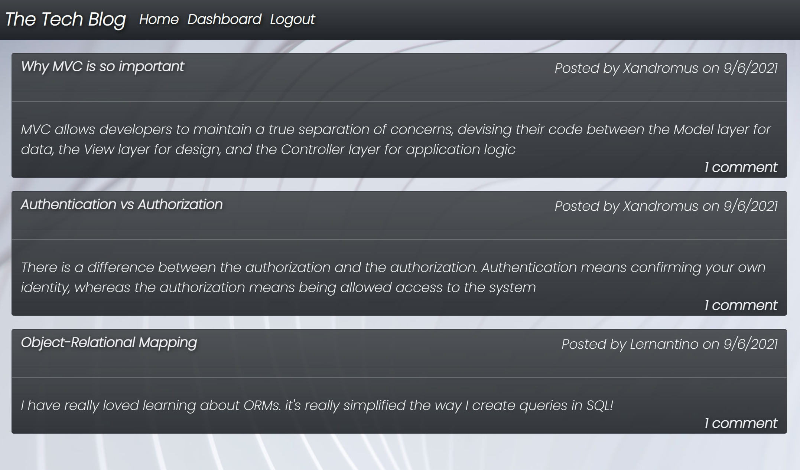
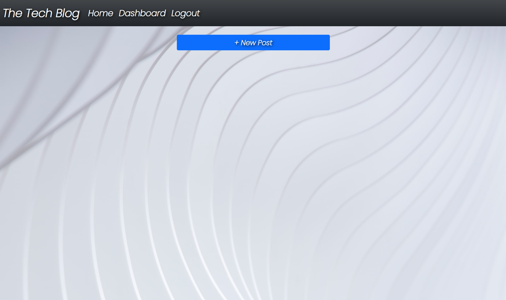
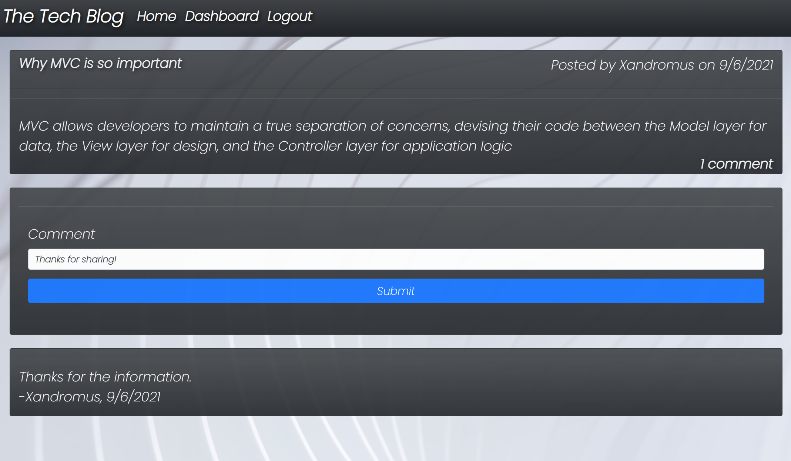
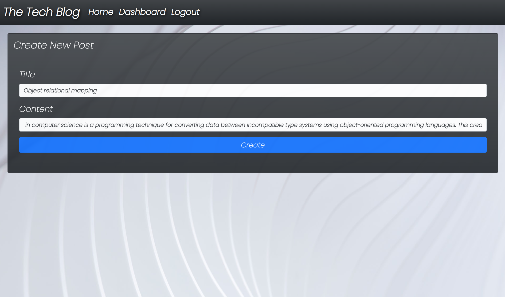
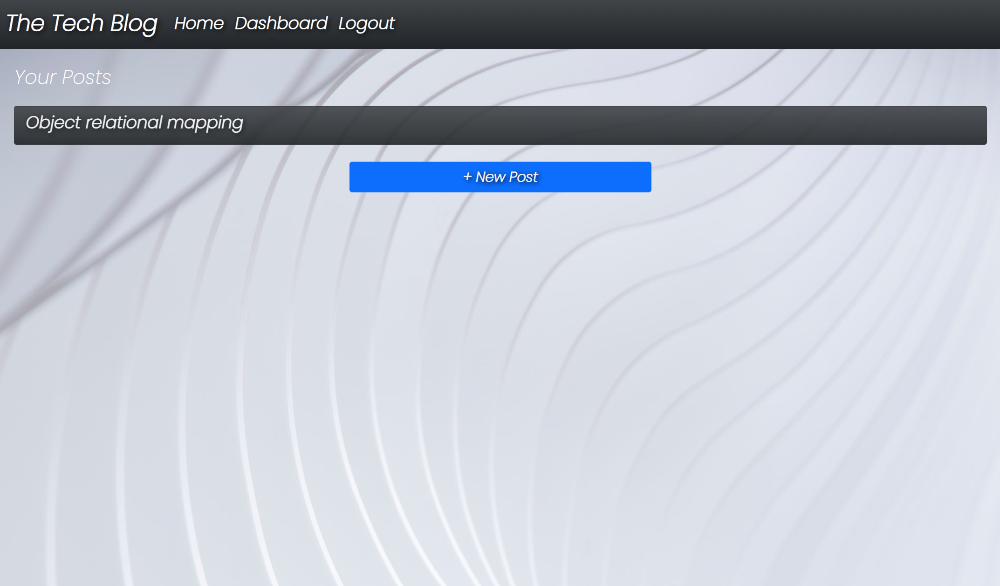
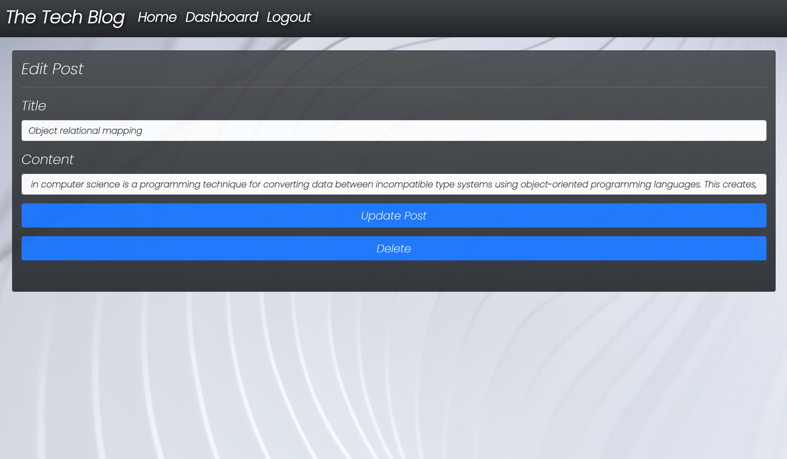
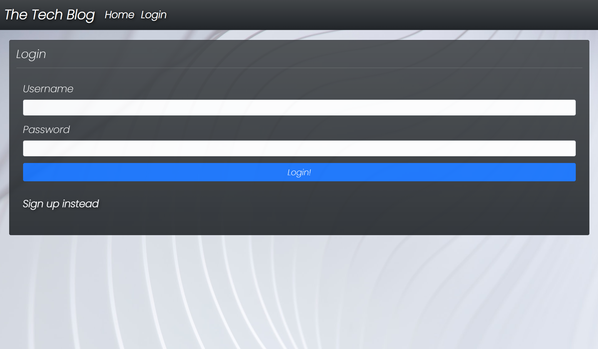
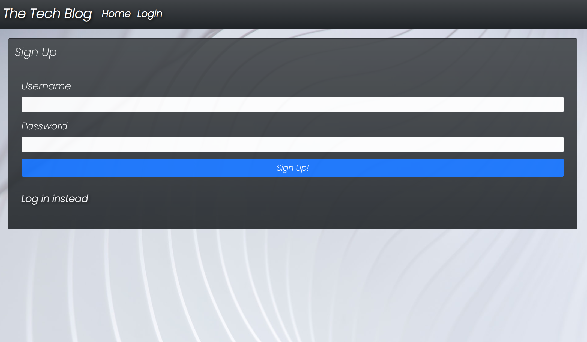

# Full Stack Tech Blog

## Table of Contents

- [Description](#description-)
- [Licenses](#licenses-)
- [Installation](#installation-)
- [Usage](#usage-)
- [Technologies](#technologies-)
- [Screen shots](#screen-shots-)
- [Credits](#credits-)
- [Contributions](#contributions-)
- [Questions](#questions-)


## Description : 
This is a full stack web application CMS-style sit similar to a Wordpress site. This app follows the MVC paradigm in its architectural structure, with the use of Handlebars.js as the templating engine with Sequelize for ORM and express-session package for authentication and the use of cookies to stay logged in.

## Licenses :
[](https://opensource.org/licenses/MIT)


[Click here to see the running Full Stack Tech Blog!](https://fathomless-citadel-98626.herokuapp.com/)


## Installation : 
To install the Full Stack Tech Blog App use the instructions bellow &#8595;
```
 npm install

 mysql -u root -p

 source db/schema.sql
 
 npm run seeds

 npm run start
```


## Usage : 
User needs to install the app by running the command `npm install` then user needs to run the command `mysql -u root -p` with the mysql password entered user needs to run the command `source db/schema.sql;` to start the database then the `quit;` command to exit the mysql server after that user needs to create the `.env` file with the username the database name and the password for the environment variables. If user needs to seed the database user can run the command `npm run seeds` lastly user can run the command `npm run start` to start the express server.

## Technologies : 

- JavaScript.
- CSS.
- Handlebars.js.
- Node.js.
- Express.js.
- Sequelize.
- Connect-session-sequelize.
- Mysql2.
- mysql.
- SQL.
- Express-session.
- Dotenv.
- Bcrypt.
- Heroku.

## Screen shots : 
### Here are screen shots of my deployed Full Stack Tech Blog App!










## Credits :

- [Muiasar-Al-Ani](https://github.com/Muiasar-Al-Ani)


## Contributions :
    Contributions, issues, and feature requests are welcome!
    Give a ⭐️ if you like this project!


## Questions : 
If you have any Question please feel free to contact me:
- muiasar2012@gmail.com
- [Muiasar-Al-Ani](https://github.com/Muiasar-Al-Ani)


&copy; 2021 [Full Stack Tech Blog](https://github.com/Muiasar-Al-Ani)
